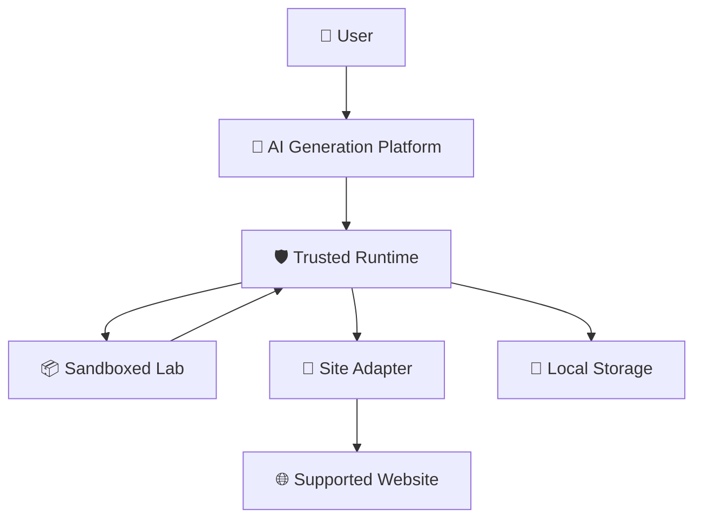
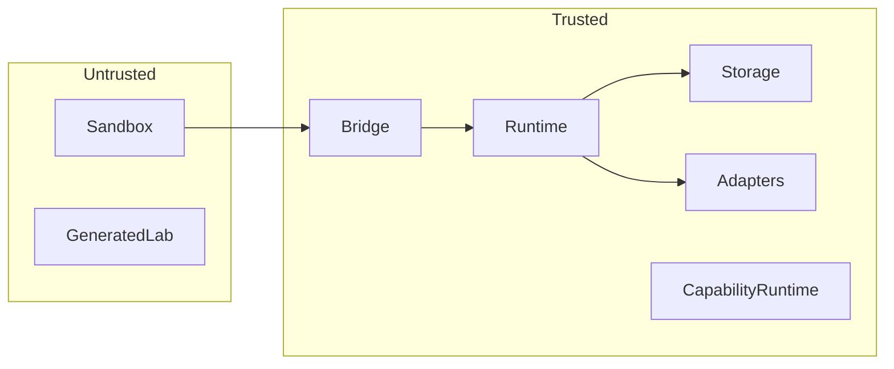
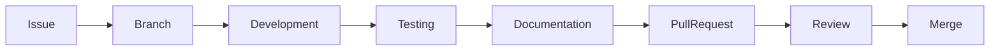
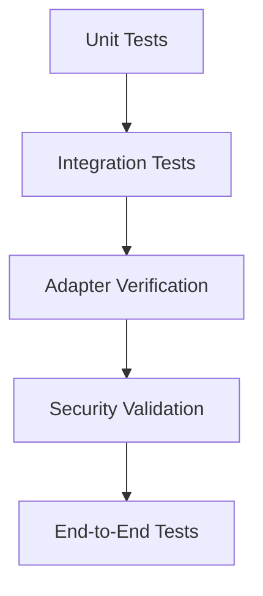
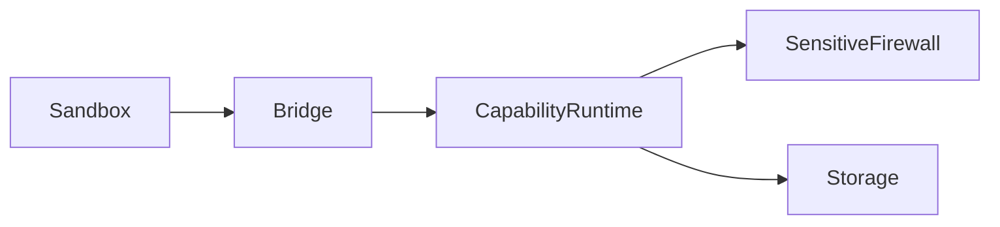

<div align="center">

# NOVUS

### AI-Generated Persistent Micro-Applications for the Modern Web

*Build intelligent tools that live inside the websites you already use.*

---


</div>

---

# Overview

Novus is an AI-powered browser platform that enables users to generate, install, and run **persistent micro-applications ("Labs")** directly inside supported websites.

Unlike traditional browser extensions that expose a fixed set of features, Novus acts as a programmable runtime. Users describe what they want in natural language, and the platform generates a secure, persistent Lab tailored to their workflow.

Every generated Lab executes inside a sandboxed runtime, communicates through a capability-based bridge, and operates under a strict security model designed around least privilege and explicit permissions.

---

## 📖 Quick Navigation

- 🏗️ Architecture → `docs/architecture/`
- 📜 Architecture Decision Records → `docs/adr/`
- 🔒 Security → `docs/security/`
- 🧩 API & SDK → `docs/api/`
- 🤝 Contributing → `docs/contributing/`
- 🗺️ Roadmap → `docs/roadmap/`

# Why Novus?

Modern knowledge work happens across dozens of web applications:

* GitHub
* LeetCode
* YouTube
* Documentation
* Internal dashboards
* Enterprise SaaS platforms

Every workflow is slightly different.

Traditional browser extensions attempt to solve this by shipping hundreds of predefined features, many of which users never need.

Novus takes a different approach.

Instead of installing another static extension, users generate exactly the tool they need.

Examples include:

* A pull request review assistant inside GitHub.
* A personalized DSA companion on LeetCode.
* A meeting note organizer embedded into internal dashboards.
* A YouTube learning workspace with persistent notes and AI summaries.
* A research assistant that lives beside technical documentation.

Rather than forcing users to adapt to software, Novus adapts software to users.

---

# Vision

Our long-term vision is simple:

> Every website should be programmable by its users.

Instead of asking:

> "Does an extension exist for this?"

users should be able to ask:

> "Can you build this workflow for me?"

Novus transforms those requests into secure, production-quality browser experiences.

---

# Core Principles

Novus is built around several architectural principles that influence every subsystem.

### 🛡️ Secure by Design

Generated Labs never receive direct access to browser APIs or privileged runtime components.

Every privileged operation passes through a replay-safe capability runtime.

---

### 🧩 Contract-First Architecture

Every generated Lab is described by a versioned Feature Manifest before execution.

The runtime validates contracts before trusting implementation.

---

### 🔒 Least Privilege

Labs receive only the capabilities they explicitly request and users approve.

No implicit permissions exist.

---

### 📦 Immutable Artifacts

Generated bundles become immutable artifacts after validation.

Published artifacts are never modified.

Updates always create new versions.

---

### 🌐 Local-First

Your browser owns your workspaces, datasets, notes, and generated Labs.

Cloud infrastructure extends the platform—it does not own it.

---

### 🤖 Provider Independent

Novus owns the AI generation pipeline.

Language models are interchangeable execution engines rather than platform dependencies.

---

# Key Features

* ✨ Generate persistent AI-powered Labs from natural language.
* 🔐 Sandboxed execution with capability-based security.
* 🧠 Provider-independent AI architecture.
* 📦 Immutable verified bundle artifacts.
* 🧩 Versioned Feature Manifest contracts.
* 🔄 Automatic compatibility validation.
* 🗂️ Persistent browser workspaces.
* 🏗️ Contract-driven adapter architecture.
* 📊 Dataset provenance and health monitoring.
* 🛡️ Sensitive Context Firewall.
* ⚡ Local-first runtime with graceful offline behaviour.
* 🔁 Replay-safe bridge protocol.
* 📈 Extensible SDK for future Labs.

---

# High-Level Architecture

```text
                           ┌────────────────────────────┐
                           │        User Prompt         │
                           └─────────────┬──────────────┘
                                         │
                                         ▼
                           ┌────────────────────────────┐
                           │      AI Generation         │
                           │ Planner • Context Builder  │
                           └─────────────┬──────────────┘
                                         │
                                         ▼
                           ┌────────────────────────────┐
                           │ Feature Manifest & Bundle  │
                           └─────────────┬──────────────┘
                                         │
                                         ▼
                           ┌────────────────────────────┐
                           │ Validation Pipeline        │
                           │ AST • Compile • Sign       │
                           └─────────────┬──────────────┘
                                         │
                                         ▼
                ┌──────────────────────────────────────────────────┐
                │             Trusted Runtime (MV3)                │
                │                                                  │
                │ Capability Runtime • Adapters • Storage • Bridge │
                └─────────────┬────────────────────────────────────┘
                              │
                              ▼
                 ┌──────────────────────────────┐
                 │ Sandboxed Generated Lab      │
                 └─────────────┬────────────────┘
                               │
                               ▼
                    Supported Website Workspace
```

---

# Documentation

The repository contains extensive technical documentation covering every major subsystem.

| Documentation        | Purpose                                 |
| -------------------- | --------------------------------------- |
| `/docs/architecture` | Platform architecture and system design |
| `/docs/adr`          | Architecture Decision Records (ADRs)    |
| `/docs/security`     | Security model and trust boundaries     |
| `/docs/api`          | Runtime and SDK specifications          |
| `/docs/contributing` | Contribution guidelines                 |


---

# 🏛️ System Architecture

Novus is not a traditional browser extension.

It is a secure runtime capable of generating, validating, installing, and executing persistent AI-generated micro-applications ("Labs") directly inside supported websites.

Instead of embedding generated code into webpages, Novus introduces a layered architecture where every component has a clearly defined responsibility and trust boundary.



The platform is intentionally divided into trusted and untrusted execution zones.

| Layer | Responsibility |
|--------|----------------|
| **AI Platform** | Generates Labs and Feature Manifests |
| **Trusted Runtime** | Security, validation, storage, permissions, bridge |
| **Sandbox** | Executes generated React applications |
| **Adapters** | Understand supported websites |
| **Storage** | Persistent local workspace state |
| **Supported Website** | External application being augmented |

---

# 🧠 Core Architecture

Novus is built around several independent subsystems that together form the execution platform.

Each subsystem owns one responsibility and communicates through explicit contracts.

## 1. AI Generation Platform

Responsible for converting natural language into executable Labs.

Responsibilities include:

- Feature planning
- Prompt construction
- Context preparation
- Provider routing
- Validation
- Artifact generation
- Repair pipeline

The runtime never executes raw AI output.

Every generated artifact must pass the complete validation pipeline before becoming installable.

---

## 2. Trusted Runtime

The Trusted Runtime is the heart of Novus.

It owns every privileged operation inside the platform.

Responsibilities include:

- Capability Runtime
- Manifest validation
- Artifact verification
- Storage management
- Adapter orchestration
- Bridge authorization
- Lifecycle management
- Security enforcement

Generated Labs never communicate directly with browser APIs.

Everything passes through the Trusted Runtime.

---

## 3. Sandboxed Runtime

Every generated Lab executes inside an isolated sandbox.

The sandbox provides:

- Process isolation
- CSP enforcement
- Typed bridge communication
- Runtime SDK
- React rendering environment

Because Labs execute inside isolated sandboxes, they cannot directly access:

- Chrome APIs
- Browser storage
- Website internals
- Runtime state
- Other Labs

All privileged operations require explicit runtime authorization.

---

## 4. Adapter Engine

Adapters allow Novus to understand supported websites.

Each adapter defines:

- supported routes
- entity schemas
- extraction strategy
- health status
- compatibility
- diagnostics
- supported capabilities

Adapters transform unstable website structures into stable platform entities.

Generated Labs never parse webpages directly.

---

## 5. Capability Runtime

Instead of exposing browser APIs, Novus exposes capabilities.

Examples include:

- Read Dataset
- Write Notes
- Create Annotation
- Open Panel
- Request AI
- Query Workspace

Every capability is:

- declared
- validated
- authorized
- audited

before execution.

This creates a consistent security model across the platform.

---

## 6. Storage Engine

Novus separates persistent storage according to responsibility.

| Storage | Purpose |
|----------|---------|
| `chrome.storage.local` | Runtime configuration and metadata |
| IndexedDB | Large persistent workspace datasets |
| In-Memory Cache | Active runtime state |

This separation improves performance while preserving long-term maintainability.

---

# 🔄 Lab Lifecycle

Every Lab follows the same lifecycle from generation to execution.

```mermaid
flowchart LR

Prompt["📝 Prompt"]

Planner["Feature Planner"]

Manifest["Feature Manifest"]

Generator["AI Generation"]

Validator["Validation Pipeline"]

Artifact["Immutable Artifact"]

Install["Installation"]

Runtime["Trusted Runtime"]

Sandbox["Sandboxed Lab"]

Prompt --> Planner
Planner --> Manifest
Manifest --> Generator
Generator --> Validator
Validator --> Artifact
Artifact --> Install
Install --> Runtime
Runtime --> Sandbox
```



A Lab is never executed immediately after generation.

It must first become a verified platform artifact.

---

# 🔐 Trust Boundaries

Security is enforced through explicit trust boundaries.



Everything outside the Trusted Runtime is treated as untrusted until verified.

This principle influences every architectural decision within Novus.

---

# 🧩 Architectural Principles

Every subsystem follows the same engineering philosophy.

| Principle | Description |
|------------|-------------|
| **Security First** | Trust is established through validation rather than assumption. |
| **Contracts Before Code** | Manifests define behaviour before implementation executes. |
| **Least Privilege** | Labs receive only explicitly approved capabilities. |
| **Local First** | User workspaces remain browser-owned by default. |
| **Provider Independent** | AI models are interchangeable execution engines. |
| **Immutable Artifacts** | Published bundles are never modified after validation. |
| **Progressive Enhancement** | Websites continue functioning independently of Novus. |
| **Versioned Evolution** | Platform changes preserve compatibility through explicit versioning. |

---

# 📦 Repository Structure

```text
novus/
│
├── apps/
│   ├── extension/
│   ├── ai-platform/
│   └── docs/
│
├── packages/
│   ├── runtime/
│   ├── sdk/
│   ├── adapters/
│   ├── shared/
│   ├── validation/
│   └── ui/
│
├── tooling/
│
├── docs/
│   ├── architecture/
│   ├── adr/
│   ├── security/
│   ├── api/
│   └── contributing/
│
└── ...
```

The repository is organized as a modular monorepo, separating platform infrastructure, runtime components, adapters, shared libraries, and documentation into clearly defined packages.

---

# 🛠️ Technology Stack

Novus combines modern web technologies with AI infrastructure and browser-native APIs to build a secure, extensible platform.

## Frontend

| Technology | Purpose |
|------------|---------|
| **React** | Component-based user interfaces |
| **TypeScript** | End-to-end type safety |
| **Tailwind CSS** | Utility-first styling |
| **Vite** | Development tooling and bundling |

---

## Browser Platform

| Technology | Purpose |
|------------|---------|
| **Chrome Manifest V3** | Browser extension platform |
| **Service Worker** | Background runtime |
| **Content Scripts** | Website integration |
| **Offscreen Documents** | Long-running browser operations |
| **Chrome Storage API** | Runtime metadata |
| **IndexedDB** | Persistent workspace storage |

---

## AI Platform

| Technology | Purpose |
|------------|---------|
| **Provider Abstraction Layer** | Multi-provider AI support |
| **Prompt Builder** | Structured prompt construction |
| **Evaluation Harness** | Generation quality validation |
| **Repair Pipeline** | Automated regeneration workflow |

---

## Runtime

| Component | Purpose |
|-----------|---------|
| **Capability Runtime** | Authorization engine |
| **Sandbox Runtime** | Secure Lab execution |
| **Adapter Engine** | Website abstraction |
| **Bridge Protocol** | Typed communication |
| **Validation Pipeline** | Bundle verification |

---

## Developer Experience

| Tool | Purpose |
|------|---------|
| **pnpm** | Package management |
| **TurboRepo** | Monorepo orchestration |
| **ESLint** | Code quality |
| **Prettier** | Formatting |
| **Vitest** | Unit testing |
| **Playwright** | End-to-end testing |

---

# 🚀 Getting Started

## Prerequisites

Before running Novus locally, ensure you have:

- Node.js **20+**
- pnpm **9+**
- Git
- Google Chrome (Latest Stable)

---

## Clone the Repository

```bash
git clone https://github.com/<your-org>/novus.git

cd novus
```

---

## Install Dependencies

```bash
pnpm install
```

---

## Start Development

```bash
pnpm dev
```

---

## Build Extension

```bash
pnpm build
```

---

## Run Tests

```bash
pnpm test
```

---

## Lint

```bash
pnpm lint
```

---

# 🧑‍💻 Development Workflow

The recommended workflow for contributors is:



Every feature should include:

- implementation
- tests
- documentation
- architecture updates (when applicable)

Significant architectural changes must also include a new Architecture Decision Record (ADR).

---

# 📚 Documentation

The documentation is organized by purpose.

| Directory | Description |
|-----------|-------------|
| `docs/architecture` | High-level system architecture |
| `docs/adr` | Architecture Decision Records |
| `docs/security` | Security model and threat analysis |
| `docs/api` | Runtime and SDK specifications |
| `docs/contributing` | Contribution guidelines |
| `docs/roadmap` | Project roadmap and milestones |

---

# 🧪 Testing Philosophy

Novus emphasizes confidence through multiple testing layers.



Testing focuses on:

- runtime correctness
- adapter stability
- capability validation
- storage integrity
- replay protection
- bridge security
- AI artifact validation

---

# 🔐 Security

Security is a foundational design principle rather than a post-development feature.

The platform enforces security through multiple independent layers.



Key security guarantees include:

- Sandboxed Lab execution
- Replay-safe bridge protocol
- Capability-based authorization
- Immutable artifact validation
- Explicit permission model
- Sensitive Context Firewall
- Local-first data ownership
- Minimum-data collection

For a detailed explanation, see the documentation in `docs/security/` and the corresponding Architecture Decision Records.

---

# 🗺️ Roadmap

The project evolves through incremental architectural milestones.

| Phase | Focus |
|--------|-------|
| Phase 0 | Architecture Foundation |
| Phase 1 | Runtime Infrastructure |
| Phase 2 | Capability Runtime |
| Phase 3 | AI Generation Pipeline |
| Phase 4 | Adapter Platform |
| Phase 5 | Lab SDK |
| Phase 6+ | Ecosystem Expansion |

Every phase builds upon the architectural principles documented throughout the repository.

---

# 🤝 Contributing

Contributions are welcome.

Before submitting a pull request:

- Read the contributing guide.
- Follow the established coding standards.
- Update documentation where appropriate.
- Add tests for new functionality.
- Create an ADR for significant architectural decisions.

We value thoughtful engineering, clear documentation, and maintainable software over rapid feature growth.

---

# 📄 License

This project is licensed under the **MIT License**.

See the `LICENSE` file for details.

---

# ❤️ Acknowledgements

Novus draws inspiration from decades of work in software architecture, browser engineering, programming language design, and modern AI systems.

The project builds upon ideas pioneered by the open-source community and aims to contribute back through transparent architecture, rigorous engineering practices, and comprehensive documentation.

---

<div align="center">

## Build once. Live inside your workflow.

**Novus** — *AI-Generated Persistent Micro-Applications for the Modern Web.*

</div>
